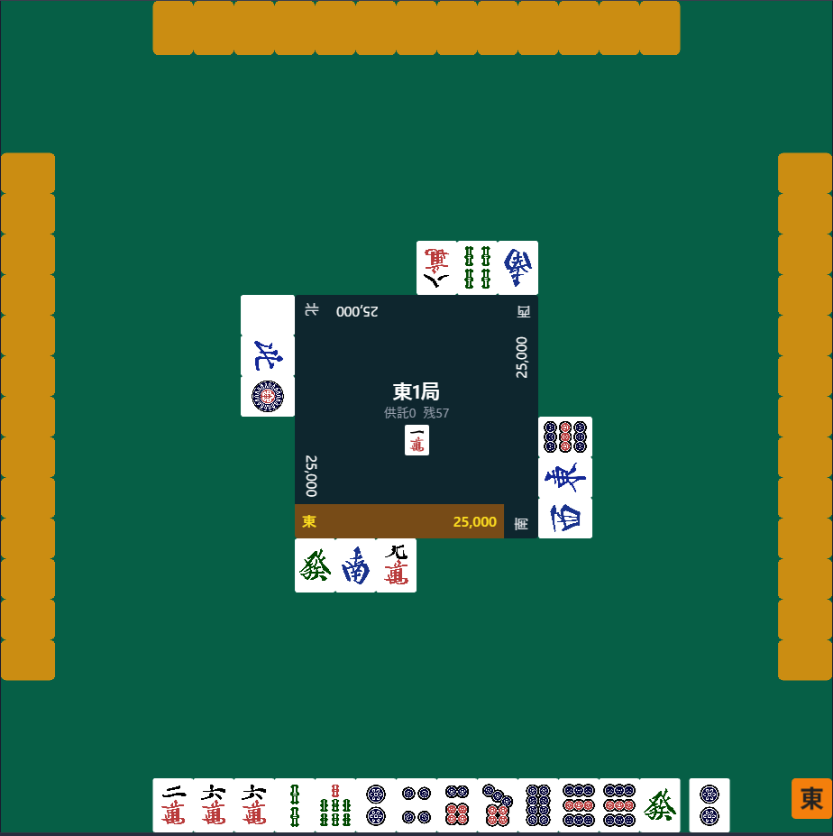

# mahjong-web



## Description

Web上で動作するシンプルな麻雀ゲームです。

特定のクラウドSDKに依存しないため、どのような環境でもデプロイ可能です。

## Requirement

- Node.js 22.x
- npm 10.x+
- Docker 20.x+
- Docker Compose V2
- PostgreSQL 17

## Install

このリポジトリをフォークしてクローンします。

```
$ git clone git@github.com:yourname/mahjong-web.git
```

## Usage

### ローカル開発

#### 1. 依存関係のインストール

```bash
npm install
```

#### 2. PostgreSQL の起動

```bash
docker compose up -d
```

#### 3. 環境変数の設定

```bash
cp packages/server/.env.example packages/server/.env
```

必要に応じて `.env` の値を編集してください。デフォルト値のままでローカル開発が可能です。

#### 4. データベースのマイグレーション

```bash
cd packages/server
npx prisma migrate dev
```

#### 5. 開発サーバーの起動

クライアント（http://localhost:5173）:

```bash
npm run dev --workspace=packages/client
```

サーバー（http://localhost:3001）:

```bash
npm run dev --workspace=packages/server
```

### AWS へのデプロイ

前提: AWS CLI が設定済みで、ECR リポジトリ・App Runner・RDS・S3・CloudFront が構築済みであること。

#### 1. Docker イメージのビルドと ECR へのプッシュ

```bash
aws ecr get-login-password --region ap-northeast-1 | docker login --username AWS --password-stdin <AWS_ACCOUNT_ID>.dkr.ecr.ap-northeast-1.amazonaws.com

docker build --platform linux/amd64 -t mahjong-web-server .
docker tag mahjong-web-server:latest <AWS_ACCOUNT_ID>.dkr.ecr.ap-northeast-1.amazonaws.com/mahjong-web-server:latest
docker push <AWS_ACCOUNT_ID>.dkr.ecr.ap-northeast-1.amazonaws.com/mahjong-web-server:latest
```

#### 2. App Runner のデプロイ

新しいイメージが ECR にプッシュされた後、App Runner コンソールからデプロイを実行するか、自動デプロイが有効な場合は自動的に更新されます。

#### 3. フロントエンドのビルドと S3 へのアップロード

```bash
VITE_SERVER_URL=https://<APP_RUNNER_URL> npm run build --workspace=packages/client

aws s3 sync packages/client/dist/ s3://<S3_BUCKET_NAME>/ --delete
```

#### 4. CloudFront キャッシュの無効化

```bash
aws cloudfront create-invalidation --distribution-id <DISTRIBUTION_ID> --paths "/*"
```

## Contribution

1. このリポジトリをフォークする
2. 変更を加える
3. 変更をコミットする
4. ブランチにプッシュする
5. プルリクエストを作成する

## License

MIT License

## Author

[minato](https://www.minatoproject.com/)
